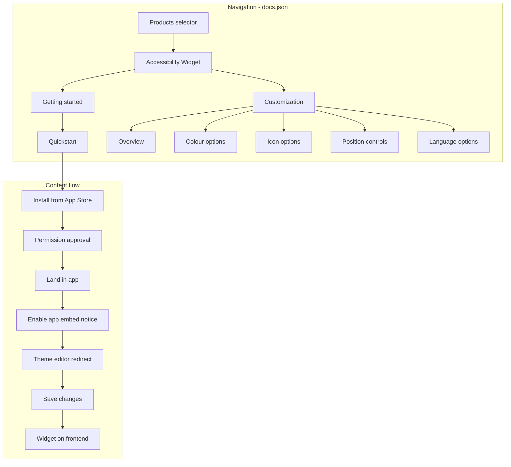

# Mintlify documentation structure for Accessibility Widget

## Architecture overview




## Navigation structure (Mintlify products)

Use Mintlify's **products** navigation to support multiple products. Accessibility Widget is the first product. This mirrors Pinecone's `guides/get-started/` and Clerk's `nextjs/getting-started/quickstart` pattern where each product has its own quickstart path.

**Recommended [docs.json](docs/docs.json) structure:**

```json
{
  "navigation": {
    "products": [
      {
        "product": "Accessibility Widget",
        "description": "Add accessibility features to your Shopify storefront",
        "icon": "wheelchair",
        "groups": [
          {
            "group": "Getting started",
            "icon": "rocket",
            "pages": [
              "accessibility-widget/quickstart"
            ]
          },
          {
            "group": "Customization",
            "icon": "palette",
            "pages": [
              "accessibility-widget/customization/overview",
              "accessibility-widget/customization/colour",
              "accessibility-widget/customization/icon",
              "accessibility-widget/customization/position",
              "accessibility-widget/customization/language"
            ]
          }
        ]
      }
    ]
  }
}
```

## File structure

```
docs/
├── index.mdx                          # Home: product overview, links to quickstarts
├── accessibility-widget/
│   ├── quickstart.mdx                 # Getting started (install → enable → save)
│   └── customization/
│       ├── overview.mdx              # Customization intro + screenshot
│       ├── colour.mdx                 # Color options
│       ├── icon.mdx                   # Icon size and shape
│       ├── position.mdx               # Position and fine-tune margins
│       └── language.mdx               # Language options
└── assets/                            # Images (copy from cursor assets)
    ├── enable-widget-notice.png       # Image 3: "Accessibility widget is not active"
    ├── app-embed-save.png             # Image 2: App embeds section
    └── customization-preview.png      # Image 1: Customisation screenshot
```

## Content structure (PlanetScale-style)

Each page follows PlanetScale patterns: **Overview** at top, **numbered sections** with clear headings, **images** where relevant, and **concise sentences** per AGENTS.md.

### 1. Quickstart ([accessibility-widget/quickstart.mdx](docs/accessibility-widget/quickstart.mdx))


| Section                | Content                                                                                                    |
| ---------------------- | ---------------------------------------------------------------------------------------------------------- |
| Intro                  | One-paragraph overview: "Get the Accessibility Widget on your Shopify store in minutes."                   |
| Install from App Store | Link to [Shopify App Store](PLACEHOLDER_URL). Install steps same as other apps.                            |
| Approve permissions    | During installation, Shopify asks for permission approval.                                                 |
| Land in the app        | After approval, you land in the web-accessibility app.                                                     |
| Enable app embed       | Notice banner: "Accessibility widget is not active." Include **Image 3** (enable-widget-notice.png).       |
| Click Enable widget    | Redirects to theme editor → App embeds section.                                                            |
| Save changes           | App embed enabled by default. Include **Image 2** (app-embed-save.png). User only needs to click **Save**. |
| Widget visible         | Widget appears on storefront.                                                                              |


**Components:** Use `<Card>` or `<CardGroup>` for "Next steps" (link to Customization overview). Use `<Steps>` or numbered list for the flow.

### 2. Customization overview ([accessibility-widget/customization/overview.mdx](docs/accessibility-widget/customization/overview.mdx))


| Section                  | Content                                                     |
| ------------------------ | ----------------------------------------------------------- |
| Overview                 | One paragraph: what you can customize                       |
| Customization screenshot | **Image 1** (customization-preview.png) showing the full UI |
| Options at a glance      | Quick links to Colour, Icon, Position, Language             |


### 3. Colour options ([accessibility-widget/customization/colour.mdx](docs/accessibility-widget/customization/colour.mdx))

- Overview: Select the primary colour for the widget.
- Colour picker and hex input.
- Reference to screenshot (Image 1) if needed.

### 4. Icon options ([accessibility-widget/customization/icon.mdx](docs/accessibility-widget/customization/icon.mdx))

- Size: Small, Medium, Large (dropdown).
- Shape: Four icon options (stick figure, accessibility symbol, wheelchair, wheelchair with arrow).
- Reference to screenshot.

### 5. Position controls ([accessibility-widget/customization/position.mdx](docs/accessibility-widget/customization/position.mdx))

- Desktop vs Mobile toggle.
- Position grid (4 corners).
- Fine-tune: Vertical margin (max 80px), Horizontal margin (max 80px).
- Reference to screenshot.

### 6. Language options ([accessibility-widget/customization/language.mdx](docs/accessibility-widget/customization/language.mdx))

- Language dropdown.
- Example: English (English).

## Image handling

Copy the three provided images into `docs/assets/`:

- `image-b3b38bd1-490e-4b39-880c-78b6e39c2a36.png` → `enable-widget-notice.png` (Image 3)
- `image-45538ebe-3d8a-4a49-aacd-7a86cec3b859.png` → `app-embed-save.png` (Image 2)
- `image-6c57db55-611a-48a7-9154-a04f21a61f81.png` → `customization-preview.png` (Image 1)

Use Mintlify image syntax:

```mdx

```

## Home page ([index.mdx](docs/index.mdx))

- Replace Mint Starter content with product overview.
- Card linking to **Accessibility Widget quickstart**.
- Optional: "Explore by product" section for future products.
- Keep tone friendly and non-technical.

## Style and terminology (AGENTS.md)

- **Active voice, second person:** "You can customize..." not "Users can customize..."
- **One idea per sentence:** Short, clear sentences.
- **Sentence case** for headings.
- **Bold for UI:** "Click **Enable widget**", "Click **Save**".
- **Code for paths/commands:** `docs.json`, `mint dev` (if used).

## Adding future products

When adding more products:

1. Add a new folder under `docs/` (e.g. `docs/another-product/`).
2. Add a new product entry in `docs.json` under `products`.
3. Each product gets its own quickstart and groups.

## Placeholder for App Store link

Use `[Shopify App Store](PLACEHOLDER_URL)` in the quickstart. Replace `PLACEHOLDER_URL` with the real link when available.